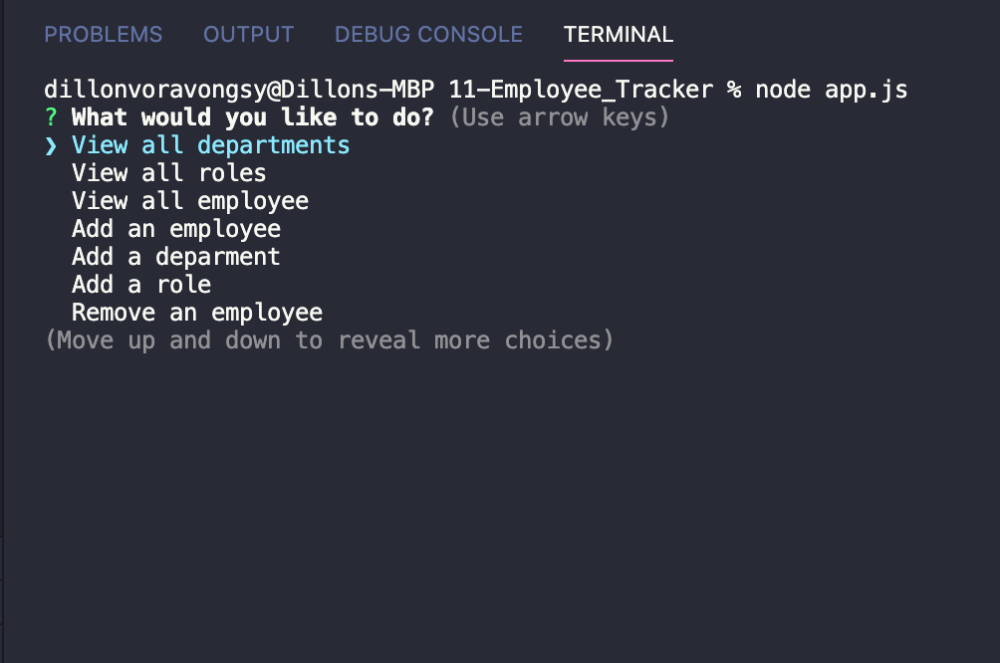

# Employee Tracker

# Table of Contents

1. [Description](#Description)
2. [Installation](#Installation)
3. [Usage](#Usage)
4. [Test](#test)
5. [License](#License)
6. [Questions](#Questions)

## Description

Track employee list, departments, and roles     
## Installation
Install node.js, mysql, and inquierer
## Usage
To track an employee's name, salary, department, or role
## Contributing
Myself
## Test
When testing/using this script, type "node app.js" into the terminal. You will then be prompt with a menu with a list of options.
## License
MIT
## Questions
* Github: https://github.com/dvorav
* Email: dillonvora952@gmail.com